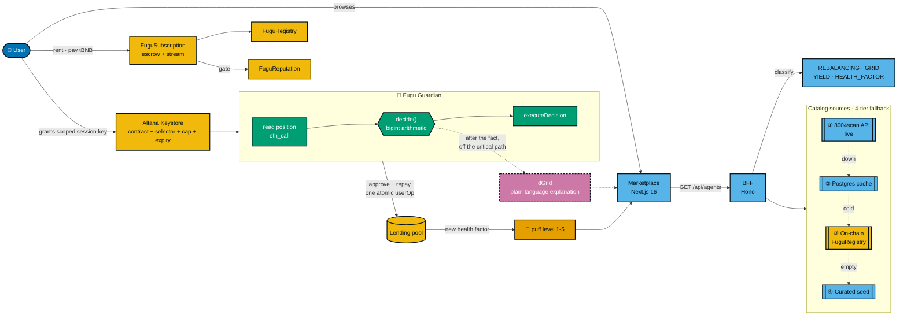
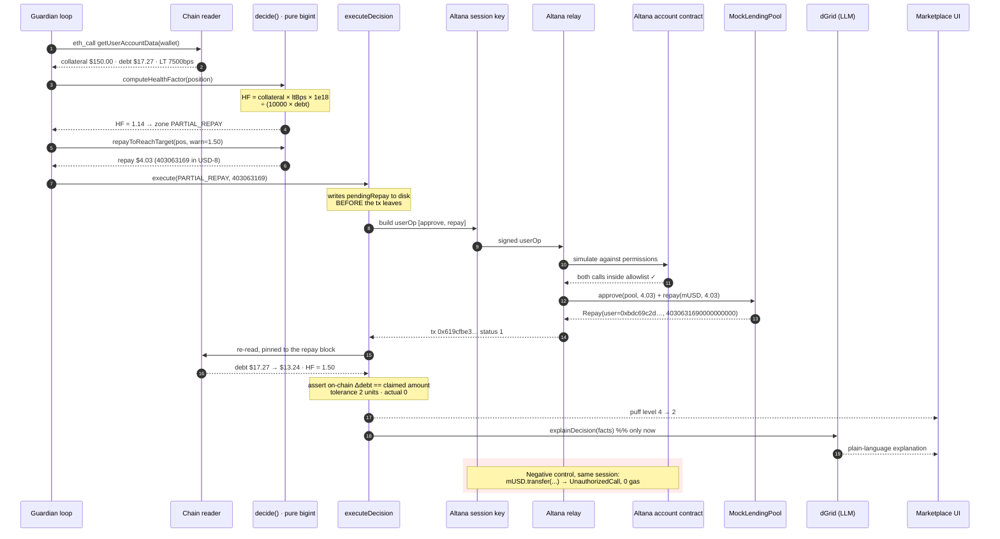

<div align="center">

# 🐡 Fugugent

### A marketplace of DeFi agents on BNB Chain where the fish puffs up as the risk does.

Every agent is a cartoon pufferfish. Its **puff level** is not decoration — it is a real risk
metric rendered as a shape. When the health factor of the position it guards falls, the fish
gets rounder, spikier, and ringed in amber. Every number on a card comes from a contract call
you can repeat yourself.

<br>


<br>

**[Contracts on BscScan](#-live-on-bnb-chain-testnet--verify-it-yourself)** ·
**[Receipts](#-receipts-not-screenshots)** ·
**[Run it locally](#-try-it-yourself)** ·
**[Limitations](#-security--limitations)** ·
**[Repo](https://github.com/Lexirieru/fugugent)**

Built for the BNB Chain hackathon **"The Smart Money Era: Build the Era"**.

> **There is no public deployment yet.** Everything below either runs on BSC testnet — where
> anyone can read it without an account — or runs on your machine with `docker compose up -d`.
> We would rather hand you a `cast call` than a screenshot.

</div>

---

## 🩸 The problem

Two problems, and the second one is the harder one.

**A lending position does not get liquidated because the borrower is broke. It gets liquidated
because the borrower was asleep.** The collateral fell 13% overnight, the health factor slid
from 1.8 to 0.99, and the liquidation bot — which never sleeps — took its bonus out of someone
who had the money to repay and simply was not at the screen. The fix is boring and mechanical:
watch the position, and when it crosses a threshold, pay part of the debt back. Nobody wants to
be the human doing that at 3am, and handing a bot your private key to do it for you is a worse
trade than the liquidation.

**And in the agent market, nobody can check anything.** On 26 February 2026, Giza wound down
ARMA and Pulse — a DeFi agent product that had advertised >$16M TVL, $1.3B in "agentic volume",
15% APY, and a backtest claiming "2x yield enhancement". It was replaced by a successor showing
large assets-under-agent figures with no third-party verification, while an independent on-chain
measurement in June 2026 found agent positions near zero. The dashboard told one story and the
chain told another, and no visitor to that dashboard had any way to tell which was true.
(Sources and the full landscape survey: [`docs/research/05-competitive-landscape.md`](docs/research/05-competitive-landscape.md).)

That is the bar Fugugent sets for itself: **every number a card shows must be reachable by a
call anyone can make.** If we cannot link it to a transaction, an event log, or an `eth_call`,
it does not go on the card.

---

## 🐡 What it does

| | | |
|---|---|---|
| 🐟 | **Agents are pufferfish** | Four cartoon fugu, one per DeFi category. Their body shape is bound to a risk number, not to a mood. |
| 🎈 | **Bloat = risk load** | Five levels, driven by the same thresholds the decision engine uses. Level 3 is the first level that spends money, and the ring pattern changes from solid to dashed to say so without relying on color. |
| 🔑 | **Scoped session keys** | An agent never holds your keys. It holds an Altana session key restricted to a contract **and** a function selector, with a daily spend cap and an expiry. Anything else is rejected by the account contract. |
| 🧮 | **Deterministic strategies** | Every financial decision is bigint arithmetic with a written justification and a backtest. No LLM sits on the path between a price and a transaction. |
| 🔍 | **On-chain marketplace** | Listing, hiring, streaming payment, and reviews are four upgradeable contracts on BSC testnet. Reviews are gated on the agent actually having been paid. |
| 📊 | **Real agent data** | The catalog is classified from live 8004scan data, with a four-tier fallback that has been tested by cutting the network, not by flipping a config flag. |

---

## ⛓️ Live on BNB Chain testnet — verify it yourself

Network: **BSC testnet, chainId 97** · RPC `https://data-seed-prebsc-1-s1.bnbchain.org:8545`
· Explorer [testnet.bscscan.com](https://testnet.bscscan.com)

All four are **UUPS upgradeable** and all four implementations are **verified on BscScan**, so
the *Read as Proxy* / *Write as Proxy* tabs work.

### Product contracts

| Contract | What it holds | Proxy (use this address) | Verified implementation |
|---|---|---|---|
| **FuguRegistry** | The agent catalog: listing, category, price, owner vs. agent wallet | [`0xb2f36070E6eae3353E8e755172B477DF213ae248`](https://testnet.bscscan.com/address/0xb2f36070E6eae3353E8e755172B477DF213ae248) | [`0xD68968cf68E9930a689e0fC9d648a898050a548A`](https://testnet.bscscan.com/address/0xD68968cf68E9930a689e0fC9d648a898050a548A) |
| **FuguSubscription** | Escrow + time-streamed payment from renter to agent | [`0xfdb083371f44Cf53181350389D3217e51B431776`](https://testnet.bscscan.com/address/0xfdb083371f44Cf53181350389D3217e51B431776) | [`0x06bc0ba1dbc3b6fd22defe7a0cd9a6cd13c15e97`](https://testnet.bscscan.com/address/0x06bc0ba1dbc3b6fd22defe7a0cd9a6cd13c15e97) |
| **FuguReputation** | Reviews, gated on the agent having actually been paid | [`0x279B31B00F64C0ce85BCe2Bd7e377CdcAE58d400`](https://testnet.bscscan.com/address/0x279B31B00F64C0ce85BCe2Bd7e377CdcAE58d400) | [`0x30c92ffadad24ca079227a92a33b78683d36fde6`](https://testnet.bscscan.com/address/0x30c92ffadad24ca079227a92a33b78683d36fde6) |
| **FuguPriceOracle** | Chainlink-backed USD→token quoting, 8-decimal USD base | [`0xB5f72a0ab0bA971c8C4F69D4A075cB7fd7859e65`](https://testnet.bscscan.com/address/0xB5f72a0ab0bA971c8C4F69D4A075cB7fd7859e65) | [`0x864f888330821b6025b2FE670f30E01Ee8776449`](https://testnet.bscscan.com/address/0x864f888330821b6025b2FE670f30E01Ee8776449) |

You do not have to trust the implementation column. Read the ERC-1967 slot yourself:

```bash
cast storage 0xb2f36070E6eae3353E8e755172B477DF213ae248 \
  0x360894a13ba1a3210667c828492db98dca3e2076cc3735a920a3ca505d382bbc \
  --rpc-url https://data-seed-prebsc-1-s1.bnbchain.org:8545
# 0x000000000000000000000000d68968cf68e9930a689e0fc9d648a898050a548a
```

### Test rig — **not part of the product**

These exist so a rescue agent can be tested against a position that really moves. The
lending pool is **ours**, written by us, ABI-compatible with Aave v3's `getUserAccountData`.
The positions and the transactions are real; the pool is not a real lending market.

| Contract | Address |
|---|---|
| MockLendingPool | [`0xb3e1F06Ac529aded2aA20aA38F4C0b4AD317e5F5`](https://testnet.bscscan.com/address/0xb3e1F06Ac529aded2aA20aA38F4C0b4AD317e5F5) |
| MockTokenUSD (mUSD, 18 decimals) | [`0x932E82632E80b06318ca969e33F99A54F1a04b10`](https://testnet.bscscan.com/address/0x932E82632E80b06318ca969e33F99A54F1a04b10) |
| MockTokenBNB (mBNB, 18 decimals) | [`0xF380E8B6803aD065EF0567dd20C894a55050737c`](https://testnet.bscscan.com/address/0xF380E8B6803aD065EF0567dd20C894a55050737c) |
| MockPriceFeed mBNB (8 decimals) | [`0x0aA42416bAccdb2fd4768B61111DeB7F7D212F9B`](https://testnet.bscscan.com/address/0x0aA42416bAccdb2fd4768B61111DeB7F7D212F9B) |
| MockPriceFeed mUSD (8 decimals) | [`0x5B0770513b6CD76Bf225462F3ec42783E8Da69A1`](https://testnet.bscscan.com/address/0x5B0770513b6CD76Bf225462F3ec42783E8Da69A1) |

### Accounts

| Role | Address |
|---|---|
| Deployer / EOA | [`0x56A2950ddE6B1040d1DCC4b4C4Fc314Bd56eFB0E`](https://testnet.bscscan.com/address/0x56A2950ddE6B1040d1DCC4b4C4Fc314Bd56eFB0E) |
| Fugu Guardian — Altana wallet | [`0xbdc69c2d7FE7337C86d6Ab63E1B3A89D67e5A0c0`](https://testnet.bscscan.com/address/0xbdc69c2d7FE7337C86d6Ab63E1B3A89D67e5A0c0) |
| Fugu Rebalancer — Altana wallet | [`0xb8f155D1278f0437b9De7c63911f2C0EDa485941`](https://testnet.bscscan.com/address/0xb8f155D1278f0437b9De7c63911f2C0EDa485941) |
| Fugu Grid — Altana wallet | [`0x2AA59d5cf540c8f1b1CE4C667C2e745475d4EAd9`](https://testnet.bscscan.com/address/0x2AA59d5cf540c8f1b1CE4C667C2e745475d4EAd9) |
| Fugu Yield — Altana wallet | [`0x15dE73F47Ca58a11A6Ef9dB24dfDc6F096b0a866`](https://testnet.bscscan.com/address/0x15dE73F47Ca58a11A6Ef9dB24dfDc6F096b0a866) |
| Altana Keystore (session key registry) | [`0x6b8361C29d05D498b1a12B54A37310f94171E94A`](https://testnet.bscscan.com/address/0x6b8361C29d05D498b1a12B54A37310f94171E94A) |
| Altana Controller | [`0xb530D1971f5453F3359518343F05D0AedFfF7e12`](https://testnet.bscscan.com/address/0xb530D1971f5453F3359518343F05D0AedFfF7e12) |

---

## 🧾 Receipts, not screenshots

Three claims carry the project. Each one links to a transaction you can open.

### 1. The Guardian rescued a real position

| | |
|---|---|
| **Claim** | An agent read a position, decided on its own how much to repay, sent the repayment, and the health factor rose from **1.14** to **1.50**. |
| **Repay tx** | [`0x619cfbe351703913ebafd0e76db86af0f90953bbff33335d78d8dbf1e41e08cc`](https://testnet.bscscan.com/tx/0x619cfbe351703913ebafd0e76db86af0f90953bbff33335d78d8dbf1e41e08cc) — status 1, block 129,852,222 |
| **Price drop that created the danger** | [`0x19c09c5123c702d30bbb5532680895f4ccf717376976033e066a8cda1aa88ab6`](https://testnet.bscscan.com/tx/0x19c09c5123c702d30bbb5532680895f4ccf717376976033e066a8cda1aa88ab6) — block 129,852,205 |
| **Price restored afterwards** | [`0x82cc9086bd03dbd7fd73dcc47884e4f757220d317dae3a86716790bca89e6801`](https://testnet.bscscan.com/tx/0x82cc9086bd03dbd7fd73dcc47884e4f757220d317dae3a86716790bca89e6801) — block 129,852,279 |
| **Amount** | $4.03 repaid — `403063169` in 8-decimal USD base. The on-chain debt decrease was `403063169`. **Difference: 0 units.** |
| **Who picked the amount** | `repayToReachTarget(pos, warn)` in `decide.ts` — the exact amount that lands the health factor back on the 1.50 threshold. It landed on `1500000000000000000`. |
| **Honest caveat** | The lending pool is ours (see [Security & limitations](#-security--limitations)). What is proven here is the chain read → decide → execute → HF rose, not that the Guardian runs on Aave. |

An earlier run of the same code path — kept in the evidence log as history, superseded by the
one above — is [`0xd7acda4cc6505da3ea9b89911b7fa8a884147f0e67e11e6fb9cc8d99d638d06e`](https://testnet.bscscan.com/tx/0xd7acda4cc6505da3ea9b89911b7fa8a884147f0e67e11e6fb9cc8d99d638d06e)
(block 129,849,537, $5.25 repaid, same 1.14 → 1.50). We replaced it as the binding receipt because
the state store changed between runs, and **evidence for code that is no longer running is not
evidence**. Full history: [`docs/e2e/2026-09-08-e2e-testnet.md`](docs/e2e/2026-09-08-e2e-testnet.md).

### 2. It was signed by a **capped session key**, not by an all-powerful key

| | |
|---|---|
| **Claim** | The repayment was signed by an Altana session key restricted to two functions — not by the deployer EOA. |
| **Proof in the receipt** | The `Repay` event's `user` field is `0xbdc69c2d…` — the Guardian's **Altana wallet** — and the transaction's `from` is an Altana relay (`0x09f6ac70…`), not `0x56A2950d…`. `Repay.user` *is* `msg.sender` at the pool. |
| **The session key is registered on chain** | keyHash `0x7a467115cdf6d03f85f0f059733843b43cbe291d9f4489e3bf27d45e5148b377`, grant tx [`0x15e67a21…`](https://testnet.bscscan.com/tx/0x15e67a21e5ec25f8459ac2e83798033ca9afe5a14b41143aeb28fe2a47b64b52) |
| **Check it with one `eth_call`, no API key** | see below — returns `true` |

```bash
cast call --rpc-url https://data-seed-prebsc-1-s1.bnbchain.org:8545 \
  0x6b8361C29d05D498b1a12B54A37310f94171E94A \
  'isValidKey(address,bytes32)(bool)' \
  0xbdc69c2d7FE7337C86d6Ab63E1B3A89D67e5A0c0 \
  0x7a467115cdf6d03f85f0f059733843b43cbe291d9f4489e3bf27d45e5148b377
# true
```

The whole session allowlist is two entries, each binding a **contract and a selector**:

| Contract | Selector allowed |
|---|---|
| `MockLendingPool` `0xb3e1F06A…` | `repay(address,uint256)` |
| `mUSD` `0x932E8263…` | `approve(address,uint256)` |

Daily spend cap **0.02 tBNB + 100 mUSD**. Expiry **8 October 2026**. Nothing else.

### 3. An out-of-allowlist call was rejected **by the account contract**, not by our code

This is the one that matters. Anyone can write an `if` statement that refuses to send a
transaction. We wanted the refusal to come from somewhere we do not control.

| Attempt through the same session | Why it is outside the boundary | Result |
|---|---|---|
| `mUSD.transfer(0x56A2950d…, 1 wei)` | the contract is allowlisted for `approve`; the `transfer` **selector** is not | rejected |
| `mBNB.approve(pool, 1 wei)` | the `approve` selector is allowlisted for mUSD; the **mBNB contract** is not | rejected |

Both fail with the Altana account contract's custom error:

```
Reason: UnauthorizedCall
Details: UnauthorizedCall({ keyHash: 0x80c191a2…, target: 0x932e82632e80b06318ca969e33f99a54f1a04b10, data: 0xa9059cbb… })
```

Zero gas burned, balances unmoved. Reviewing this claim, we grepped the entire `node_modules`
tree for the string `UnauthorizedCall` — **it is not there.** The rejection came from the chain.
The test helper `assertSessionDenial` is deliberately strict about this: a thrown exception is
not proof, because a dead relay, an HTTP 502, or a nonce race all throw too. The error must
contain `UnauthorizedCall` **and** name the contract we tried to call. Pointing the relay at a
dead endpoint makes the probe exit 1 instead of printing a checkmark.

> ⚠️ **What this does not prove:** the rejection leaves **no on-chain trace**. It happens while
> the relay simulates the userOp against the account contract, so there is no block a judge can
> open. The correct sentence is *"rejected by the Altana account validator during relay
> simulation"*, not *"a reverted transaction exists on chain"*.

### 4. The marketplace lifecycle, end to end

Run earlier, still valid — the full rent-and-review cycle for **0.0015 tBNB** total.

| Step | Result read back from chain | Tx |
|---|---|---|
| List an agent (Health Factor, $0.10 / 120s) | `listingCount = 1` | [`0x590d2f13…`](https://testnet.bscscan.com/tx/0x590d2f13731bef32c6409d32c9f278af8b897766a0a82e0b504acf6799ffeab7) |
| Rent it and pay in tBNB | escrow funded, `subCount = 1` | [`0x15810ba2…`](https://testnet.bscscan.com/tx/0x15810ba2b62b87931e4464b8e39b7a021398934f8a0c805dc09c6d52d7f4f6c8) |
| Agent claims its accrued share | `17668387054596` wei left in escrow | [`0xe0fd365d…`](https://testnet.bscscan.com/tx/0xe0fd365d7bee36b524056c43aa6bf81351f88e6a4745f37b811e3e1fde5e4726) |
| Write a 5-star review | `reviewCount = 1`, `averageScoreX100 = 500` | [`0xf7bd2369…`](https://testnet.bscscan.com/tx/0xf7bd23695fd0da50d46b72bdb00d6b5caf7e8552f42ac7bb23b5a042e7f527a3) |

The anti-sybil gate was checked on both sides of the money: `hasSubscribed` was `false` before
the agent was paid and `true` after. That is the whole content of "only people who actually paid
can review", and it flips at the moment money moves, not at the moment someone subscribes. A
second review from the same wallet reverts.

---

## 🗺️ How it works



### One Guardian cycle, call by call



Note the ordering: `explainDecision` is called **after** the repayment is already broadcast. The
full cycle took 15.1 seconds including the dGrid call — which is only possible because the money
never waited for the model.

---

## 🐟 The four agents

> ### The LLM explains decisions. It never makes them.
>
> This is rule number one and nothing in the codebase is allowed to break it. Every number that
> moves money is deterministic bigint arithmetic with a written justification and a backtest.
> dGrid (`openai/gpt-5.6-luna`) has been measured between 8 and 46 seconds per call — it is used
> for asynchronous explanation and for a research agent, and never on the critical path. If the
> model is down, slow, or hallucinating, the position is still defended correctly.

| Agent | Category | Colour | State today |
|---|---|---|---|
| 🛡️ **Fugu Guardian** | `HEALTH_FACTOR` | cobalt | decision engine + execution + monitoring loop — **proven on chain through a scoped session key** |
| ⚖️ **Fugu Rebalancer** | `REBALANCING` | pink | decision engine + backtest — **not yet wired to execution** |
| 📐 **Fugu Grid** | `GRID` | light blue | decision engine + backtest — **not yet wired to execution** |
| 🌾 **Fugu Yield** | `YIELD` | green | decision engine + backtest — **not yet wired to execution** |

### The threshold that decides each strategy

None of these are magic numbers. Each has a written reason in the source, and each is the reason
the agent *refuses* to act more often than it acts.

**Fugu Rebalancer — a 50 bps cost gate on turnover.** Portfolio rebalancing is worth a few
hundred bps *per year*; paying more than 50 bps in a single rebalance means the trade is eating
the thing it was supposed to earn. The interesting part is `minEconomicTurnoverBase()`: instead
of guessing a minimum trade size, it **derives** one from gas cost and the cost budget —
`T ≥ gas × 10000 / (M − r)` — and a configuration where no turnover can ever clear the bar fails
loudly at the entrance instead of silently never trading.

**Fugu Grid — line spacing must be at least 2× the round-trip cost.** A grid whose step is
narrower than the cost of one buy-and-sell pair looks busy and grinds the capital down. The
constraint is expressed against gas-per-lot, so it tightens automatically when the lot gets small.

**Fugu Yield — `breakEvenSpreadBps = ceil(cost × 10000 × 365 / (principal × days))`, then × 2.00.**
The migration cost is paid once; the yield spread is earned per day. That asymmetry is brutal at
small size: moving **$10,000** needs a 390 bps spread to break even, moving **$200** needs
**1,582 bps**. The 2.00× safety multiple on top is a product decision, and the source says so
rather than pretending it was derived.

### The backtests that contradicted us

> **Two of our own backtests proved the person who wrote the strategy wrong.** We kept the
> results and named the tests after it.

| Test | What it found |
|---|---|
| `KEJUJURAN: pada ayunan besar di portofolio besar, 'rebalance selalu' justru unggul — pita ada ongkosnya`<br/><sub>`ai/fugurebalancer/…/__tests__/backtest.test.ts`</sub> | On large swings in a large portfolio, always-rebalance beats the deviation band. The band is not free. |
| `KEJUJURAN: pada tren naik, beli-lalu-diamkan mengalahkan grid — grid menjual kenaikannya`<br/><sub>`ai/fugugrid/…/__tests__/backtest.test.ts`</sub> | In a directional uptrend, buy-and-hold beats the grid. The grid sells the rally. |

*(`kejujuran` is Indonesian for "honesty".)* A backtest suite that only ever confirms its author
is not a backtest suite. These two run green in CI-less `pnpm test` alongside everything else,
and they are the reason we believe the numbers the others produce.

---

## 🎈 Puff levels

Five levels — not four, not seven. Five because that is exactly enough to cover the Guardian's
four decision thresholds (`WARN`, `PARTIAL_REPAY`, `DELEVERAGE`, `EMERGENCY`) plus one state
meaning "nothing to do".

Each level differs on **six channels at once**, because each channel survives a different failure:
body width survives 16px and blur; spikes survive in silhouette; the face survives at ≥64px and
carries the emotion; the **ring pattern** survives greyscale; the ring colour is fast for most
readers and **is never the only signal**; and the numeric text chip is the one unambiguous
channel, required on every card and detail page.

| Level | Name | Ring | Colour | Meaning |
|---|---|---|---|---|
| 1 | Calm | thin, solid, 40% arc | Reef Green `#009E73` | Nothing to do. The agent is alive and watching. |
| 2 | Watchful | solid, full, one notch | Shoal Yellow `#F0E442` | First threshold touched. Told you; spent nothing. Must **not** feel like an alarm. |
| 3 | Strained | **dashed**, full | Tide Amber `#E69F00` | First level with a financial consequence — the agent is about to spend money. The solid→dashed change says so without colour. |
| 4 | Critical | — | — | see [`docs/brand/tingkat-kembung.md`](docs/brand/tingkat-kembung.md) |
| 5 | Emergency | — | — | see [`docs/brand/tingkat-kembung.md`](docs/brand/tingkat-kembung.md) |

**Absolute rule: the agent's body colour never changes with puff level.** Only the body shape
and the ring change. A Guardian in an emergency is still cobalt; it is just round, spiked, and
ringed.

The thresholds come from **one source** — `ai/fuguguardian/app/agent/src/strategy/types.ts`
(`DEFAULT_THRESHOLDS`), and the backend ships `bloatLevel: 1|2|3|4|5` derived from it. If the
UI number and the engine number ever diverge, we have reproduced exactly the failure that killed
ARMA: a dashboard telling a different story from the chain.

The character art is **hand-written parametric SVG** generated by `docs/brand/generate-svg.py`
from the same geometry numbers as the spec — not output from an image model. See
[Security & limitations](#-security--limitations).

---

## 🎚️ Risk parameters and constants — and how to read them yourself

### Guardian thresholds (1e18 base, source of truth in TypeScript)

| Threshold | Value | Meaning |
|---|---|---|
| `warn` | `1_500_000_000_000_000_000n` = **1.50** | notify; also the repayment *target* |
| `partialRepay` | `1_200_000_000_000_000_000n` = **1.20** | repay part of the debt |
| `deleverage` | `1_100_000_000_000_000_000n` = **1.10** | reduce the position |

```bash
# read them straight out of the source, not out of this README
sed -n '49,53p' ai/fuguguardian/app/agent/src/strategy/types.ts
```

### The three formulas that move money

```
HF        = collateral × ltBps × 1e18 / (10000 × debt)
dropToLiq = 10000 − ceilDiv(10000 × 1e18, HF)
repay     = debt − collateral × ltBps × 1e18 / (10000 × target)
```

`dropToLiq` is the number a user actually cares about: *how far can the collateral fall before
this gets liquidated.* At HF 1.14 that was **13.0%**.

### Unit conventions — the ones that break things

| Convention | Value | Why it matters |
|---|---|---|
| Token decimals on BSC | **18 for everything, USDT included** | not 6. Assuming 6 makes an agent pay one ten-thousandth of what it prints. |
| USD base | **8 decimals** (`12345678` = $0.12) | never rendered raw |
| Health factor base | **1e18** | |
| Chain | **chainId 97 only** | |
| bigint over the wire | serialised as **strings** | a 30-digit value passed through `Number` corrupts: `…901234567890` → `…877719597056`. Tested. |

### Reading the live marketplace state

Every one of these is a plain `eth_call` against a verified proxy — no API key, no account.
(Values shown are what they returned at the time of writing; they move as the registry is used.)

```bash
export RPC=https://data-seed-prebsc-1-s1.bnbchain.org:8545
export REG=0xb2f36070E6eae3353E8e755172B477DF213ae248
export SUB=0xfdb083371f44Cf53181350389D3217e51B431776
export REP=0x279B31B00F64C0ce85BCe2Bd7e377CdcAE58d400
export ORACLE=0xB5f72a0ab0bA971c8C4F69D4A075cB7fd7859e65

cast call $REG 'listingCount()(uint256)'                --rpc-url $RPC   # 4
cast call $REG 'countByCategory(uint8)(uint256)' 3      --rpc-url $RPC   # 1  (3 = HEALTH_FACTOR)
cast call $SUB 'subCount()(uint256)'                    --rpc-url $RPC   # 1
cast call $REP 'reviewCount(uint256)(uint256)' 1        --rpc-url $RPC   # 1
cast call $REP 'averageScoreX100(uint256)(uint256)' 1   --rpc-url $RPC   # 500  = 5.00 stars
cast call $ORACLE 'priceUsd8(address)(uint256)' \
  0x0000000000000000000000000000000000000000             --rpc-url $RPC   # 75174925837 = $751.74 BNB/USD
```

`Category` enum order: `0 = REBALANCING`, `1 = GRID`, `2 = YIELD`, `3 = HEALTH_FACTOR`
(`contracts/src/types/FuguTypes.sol`).

Or use the **Read as Proxy** tab on BscScan for any of the four contracts — it works, because the
implementations are verified and BscScan resolved the proxy.

---

## 🚀 Try it yourself

Nothing here requires a deployment, an account, or a key. It requires Docker, Foundry, and Node.

### 0. Clone with submodules

```bash
git clone --recurse-submodules https://github.com/Lexirieru/fugugent
cd fugugent
```

`contracts/lib` uses git submodules for forge-std and both OpenZeppelin repos. If you already
cloned without them: `git submodule update --init --recursive`.

### 1. Run the contract tests — 131 of them, including fuzz

```bash
cd contracts && forge test
```

Foundry 1.7.1, Solidity 0.8.30, OpenZeppelin 5.7.0. UUPS with ERC-7201 namespaced storage.

### 2. Run the agent test suites

Each agent is its own pnpm workspace; install at the agent root, test in `app/agent`.

```bash
for a in fuguguardian fugurebalancer fugugrid fuguyield; do
  ( cd "ai/$a" && pnpm install && cd app/agent && pnpm test )
done
# fuguguardian 249 · fugurebalancer 88 · fugugrid 99 · fuguyield 93
```

The two `KEJUJURAN` backtests are in there. Run them and watch our own strategies lose.

### 3. Bring the backend up

```bash
docker compose up -d --build
```

Three containers — `fugugent-postgres`, `fugugent-redis`, `fugugent-api` — and the API waits for
the other two to report healthy. Host ports for Postgres and Redis are deliberately shifted to
**55432** and **56379** so they cannot collide with a Postgres you already run on 5432. The API
listens on **8787**.

### 4. Call all four endpoints

```bash
curl -s localhost:8787/api/health | jq
curl -s localhost:8787/api/categories | jq
curl -s 'localhost:8787/api/agents?category=GRID&limit=5' | jq
curl -s localhost:8787/api/agents/97:1912 | jq
```

`/api/categories` answers from **real 8004scan data** — a live run returned
`REBALANCING 19 · GRID 42 · YIELD 29` with `source: "scan8004"` and `ageSeconds: 0`. Those are
our classifications of agents that actually exist, not seed rows.

### 5. Break it on purpose and watch it degrade honestly

```bash
# strict health: 200 while everything is up
curl -s -o /dev/null -w '%{http_code}\n' 'localhost:8787/api/health?strict=1'   # 200

docker compose stop postgres

curl -s -o /dev/null -w '%{http_code}\n' 'localhost:8787/api/health?strict=1'   # 503
curl -s -o /dev/null -w '%{http_code} %{time_total}s\n' localhost:8787/api/agents  # 200, ~0.57s

docker compose start postgres
curl -s -o /dev/null -w '%{http_code}\n' 'localhost:8787/api/health?strict=1'   # 200 again
```

Two things this shows. First, `?strict=1` tells the truth: it returned 503 when Postgres was
down and — separately, without us touching anything — when 8004scan itself fell over with an
intermittent 500. Second, the catalog still answers in **0.57s** with the database gone, down
from 31s before the timeouts were tuned. Degraded, fast, and labelled as degraded.

The four-tier fallback was proven by **blocking DNS**, not by flipping a config flag:
tier 1 8004scan (real token) → tier 2 Postgres cache → tier 3 on-chain `FuguRegistry` →
tier 4 curated seed.

### 6. Run the marketplace against your local API

```bash
NEXT_PUBLIC_API_BASE_URL=http://localhost:8787 bun --cwd frontend dev
```

Built this way, the page renders **"LingoAI Grid Trading Agent"** — the same real 8004scan agent
`/api/agents?category=GRID` returns. A build during one run showed per-category cards of
`REBALANCING 19 · GRID 24 · YIELD 24 · HEALTH_FACTOR 21`, and the detail page `/agent/97:1912`
returned HTTP 200.

Close the 8004scan gate (24 parallel requests will do it) and the page relabels itself, on its
own, to:

> **Served from our cache · 9s old · not confirmed fresh**

That sentence is the entire product thesis in one line of UI.

### 7. Verify the chain claims without running anything

Every `cast` command in [Receipts](#-receipts-not-screenshots) and in the risk-parameters section
above works from a cold terminal against the public RPC. Or open any address in the tables above on
[testnet.bscscan.com](https://testnet.bscscan.com) and use **Read as Proxy**.

---

## 🔒 Security & limitations

We would rather you read this section than find it out yourself. Everything below is a real gap,
stated plainly.

**On the agents**

- The agent **runtime** entrypoints (`dualMain.ts`, `mcpMain.ts`, `tools.ts`) do **not yet import
  `src/strategy/`**. What actually runs the full chain today is the composition root
  `createGuardian()` and the E2E scripts. The strategy is real and tested; the long-running
  daemon is not yet the thing calling it.
- **Rebalancer, Grid, and Yield are not wired to on-chain execution.** They have decision engines
  and backtests. They have wallets and registered sessions. They have not sent a transaction.
- There is **no user-pressable kill switch** yet. There is a one-way kill hook in code, with unit
  tests. There is no UI where a user sees the agent's permissions and revokes them.

**On the session key model**

- Altana permissions **do not bind argument values** — only contract + selector. The Guardian's
  session is therefore technically permitted to call `mUSD.approve(anyone, anything)`. What
  actually holds it back: the per-token spend cap on the session, our own code only ever building
  an `approve` for the pool (which is worthless the moment the process is compromised), and the
  Porto guarded executor zeroing the allowance at the end of the userOp — **third-party behaviour
  we observed empirically, not a guarantee our contracts make.** Real argument binding needs an
  intermediary contract.
- The rejection of an out-of-allowlist call **leaves no on-chain trace**. It happens during relay
  simulation. A third party can check three things — the error string is the account contract's
  custom error and appears nowhere in `node_modules`, the keyHash matches our key, and no balance
  moved — but there is no block to open.
- The **contents of the allowlist are not readable from chain.** The Altana account hash-commits
  its permissions. What is public is that the key exists and is valid; what proves the contents
  is the rejection above.
- A receipt **cannot distinguish an admin key from a session key** — both act as the same wallet
  and the Orchestrator does not log the signing keyHash. What closes that gap is that the E2E
  script only ever loads the session file, and that the same session was rejected for `transfer`,
  while an admin key never would be.

**On the test rig**

- **`MockLendingPool` is a lending pool we wrote ourselves.** It is ABI-compatible with Aave v3's
  `getUserAccountData`, and we own the price feeds we dropped to create the danger. The positions
  and the transactions are real; **the pool is not a real lending market**, and nothing here
  proves the Guardian works against Aave.

**On the platform**

- **Testnet only, chainId 97.** No private key that has ever touched mainnet is used anywhere.
- **There is no public deployment.** The backend and agents are intended for a VPS and the
  frontend for Vercel; neither has happened. The domain `hellofugu.xyz` has been purchased and
  **nothing is deployed to it** — do not expect a site there.
- No 8004scan API key yet — we are on the anonymous tier, 30 requests/minute. Calls to 8004scan
  **must** send a browser `User-Agent` or the API answers HTTP 500 (not 429), and they always go
  through the backend, never from the browser.
- The character art is **hand-written parametric SVG** from `docs/brand/generate-svg.py`. Zero
  images came from a generative model — both image MCP servers were disconnected when that work
  ran, four attempts, all failed. The prompts in `docs/brand/prompt-gambar.md` have never been
  executed and are therefore an unverified specification, not a proven recipe.
- No CI runs on this repository. The test counts in this README were counted by running the
  suites; the commands to recount them are in [Try it yourself](#-try-it-yourself).
- No `LICENSE` file has been added yet.

---

## 🧰 Tech stack

| Package | Stack | Tests | How to run |
|---|---|---|---|
| **`contracts/`** | Solidity **0.8.30** · Foundry (forge **1.7.1**) · OpenZeppelin **5.7.0** · UUPS proxies · ERC-7201 namespaced storage · Chainlink price feeds | **131** incl. fuzz | `cd contracts && forge test` |
| **`ai/fuguguardian/`** | TypeScript · BNB Agent Studio (`@bnbagent/studio-cli`) · Altana SDK **0.7.1** · viem · vitest · dGrid (OpenAI-compatible) | **249** | `pnpm test` |
| **`ai/fugurebalancer/`** | same | **88** | `pnpm test` |
| **`ai/fugugrid/`** | same | **99** | `pnpm test` |
| **`ai/fuguyield/`** | same | **93** | `pnpm test` |
| **`backend/`** | Hono · Postgres + Drizzle · Redis · viem · vitest · Docker Compose | **374** (1 skipped) | `cd backend && pnpm test` |
| **`frontend/`** | Next.js **16** · React **19** · Tailwind **v4** · bun | `bun run build` + `bun run lint` green | `bun --cwd frontend dev` |
| **`landingpage/`** | Next.js 16 → being rebuilt on React + Vite + Tailwind v4 | `bun run build` + `bun run lint` green | `bun --cwd landingpage dev` |
| | | **1,034 total** | |

Redis is up in Compose but **no code uses it yet** — it is staged for the BullMQ scheduler so
that work does not have to touch `docker-compose.yml` again.

**Infrastructure notes that cost us time, so they cost you none:**

- `RPC_URL` **must** be overridden. The SDK default points at a `binance.org` domain that is
  blocked from Indonesia. Use `https://data-seed-prebsc-1-s1.bnbchain.org:8545`.
- An **empty `calls: []` on an Altana session means unlimited permission.** Always write an
  explicit allowlist. This is the single sharpest footgun in the whole stack.
- Both 8004scan and dGrid reject requests without a browser `User-Agent` — 8004scan with a
  misleading HTTP 500, dGrid with a 403.

### Documents worth reading before changing anything

| File | Contents |
|---|---|
| [`docs/specs/2026-09-08-fugugent-design.md`](docs/specs/2026-09-08-fugugent-design.md) | Architecture spec — **binding authority** |
| [`docs/research/00-decisions.md`](docs/research/00-decisions.md) | 13 locked decisions + dGrid test results |
| [`docs/e2e/2026-09-08-e2e-testnet.md`](docs/e2e/2026-09-08-e2e-testnet.md) | Every on-chain claim in this README, with its full working |
| [`docs/research/05-competitive-landscape.md`](docs/research/05-competitive-landscape.md) | Virtuals, Olas, Almanak, Giza/ARMA, Agentverse — sourced |
| [`docs/brand/tingkat-kembung.md`](docs/brand/tingkat-kembung.md) | The five puff levels, all six visual channels |
| [`docs/setup/ENVIRONMENT.md`](docs/setup/ENVIRONMENT.md) | Credentials layout, verified addresses, network constants |

*Most documents in `docs/` are written in Indonesian; identifiers and code are English.*

---

## 👥 Team

<!--
  PLACEHOLDER — to be filled in by the repository owner.
  No verified team roster exists in this repository, so no names are invented here.
  The only attribution that can be confirmed from the repository itself is the GitHub
  account below. Replace this block with real names, roles, and links before submission.
-->

| Name | Role | Links |
|---|---|---|
| *to be filled in* | *to be filled in* | [github.com/Lexirieru](https://github.com/Lexirieru) |

> This table is a deliberate placeholder. This README does not invent contributor names, for the
> same reason it does not invent metrics.

---

<div align="center">

### 🐡

**Fugugent** — the fish puffs up as the risk does.

Built on BNB Chain testnet for **The Smart Money Era: Build the Era**.

Four verified contracts · 1,034 passing tests · one rescued position ·
one session key that was told no by a contract we do not control.

*Every claim on this page links to something you can check without asking us.*

</div>
